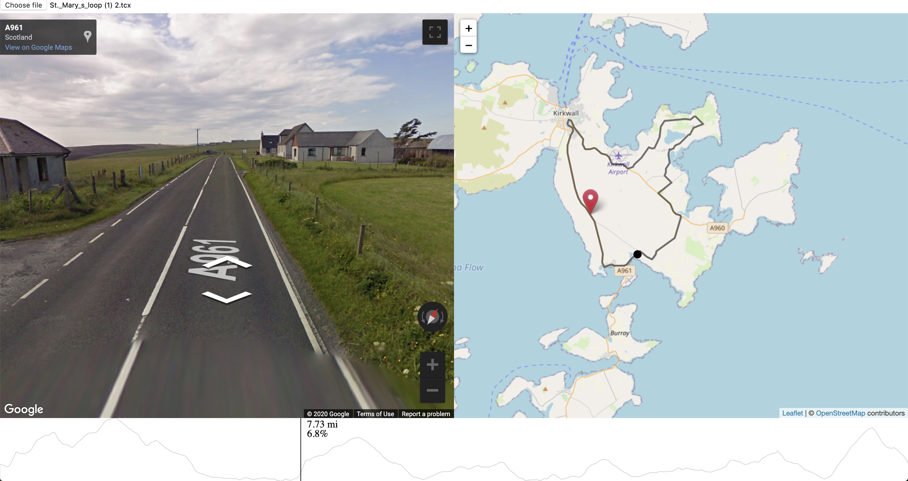

# Cycle street view

Loads a TCX file and see Google street view along the way



## Installation

Just create a creds.js file and place your google API key into that file. For example

```javascript
GOOGLE_API_KEY = <API KEY HERE>
```